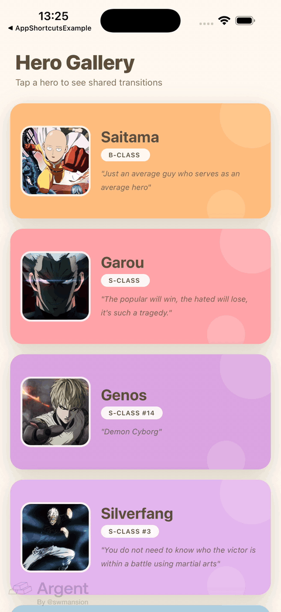

<h1 align="center">react-native-shared-transition</h1>

<p align="center">
  <b>Shared element transitions for React Native</b><br/>
  Built for the New Architecture with <a href="https://nitro.margelo.com/">Nitro Modules</a> and <a href="https://docs.swmansion.com/react-native-reanimated/">Reanimated</a>.
</p>

<p align="center">
  <a href="https://github.com/giaBaoJS/react-native-shared-transition/actions/workflows/ci.yml">
    
  </a>
  <a href="https://www.npmjs.com/package/react-native-shared-transition">
    
  </a>
  <a href="https://github.com/giaBaoJS/react-native-shared-transition/blob/main/LICENSE">
    
  </a>
  
  
  <a href="https://nitro.margelo.com/">
    
  </a>
</p>

<p align="center">
  
</p>

---

## Why?

Shared element transitions in React Native have been stuck between two options:

- **[react-native-shared-element](https://github.com/IjzerenHein/react-native-shared-element)** — the classic solution, but unmaintained, built for the old architecture, and its `react-navigation-shared-element` binding never made it past react-navigation v5.
- **Reanimated's `sharedTransitionTag`** — promising, but still marked experimental and limited in how transitions can be customized.

`react-native-shared-transition` is a small, focused take on the problem for **modern React Native** (Fabric, react-navigation v7, Reanimated 3/4):

- 🧭 **Automatic** — mount two `<SharedElement id="...">` with the same id on two screens; the transition (and its reverse on back navigation) just happens.
- 🏎️ **Nitro-powered measurement** — element frames are measured natively (JSI, no bridge) in window coordinates; originals are hidden natively while the overlay flies.
- 🎬 **UI-thread animation** — the overlay is driven by Reanimated springs/timing on the UI thread.
- 🔄 **Interruption-safe** — navigating back mid-flight retargets the running spring instead of jumping; rapid taps don't leak overlays or leave elements hidden.
- 🎨 **Morphs what matters** — position, size, `borderRadius` (rounded card → circle), image `resizeMode`, plus optional cross-fade for content that differs (e.g. text at different sizes).

## Requirements

| | |
| --- | --- |
| React Native | 0.76+ (New Architecture) |
| react-native-nitro-modules | ^0.32 |
| react-native-reanimated | ≥ 3.6 |
| iOS | 13+ |
| Android | API 24+ |

## Installation

```sh
yarn add react-native-shared-transition react-native-nitro-modules react-native-reanimated
cd ios && pod install
```

> `react-native-nitro-modules` and `react-native-reanimated` are peer dependencies. Reanimated also needs its [babel plugin](https://docs.swmansion.com/react-native-reanimated/docs/fundamentals/getting-started/) (`react-native-worklets/plugin` on Reanimated 4).

## Quick start

**1. Wrap your app with the host** (it renders the transition overlays):

```tsx
import { SharedTransitionHost } from 'react-native-shared-transition';

export default function App() {
  return (
    <SharedTransitionHost>
      <NavigationContainer>
        <RootNavigator />
      </NavigationContainer>
    </SharedTransitionHost>
  );
}
```

**2. Use a fade (or none) animation on the participating screens** — sliding screen animations would move the measured target mid-flight:

```tsx
<Stack.Navigator screenOptions={{ animation: 'fade', animationDuration: 350 }}>
  <Stack.Screen name="Home" component={HomeScreen} />
  <Stack.Screen name="Detail" component={DetailScreen} />
</Stack.Navigator>
```

**3. Mark the shared elements** — same `id` on both screens:

```tsx
// HomeScreen — grid card
<SharedElement id={`hero.${hero.id}.photo`}>
  <Image source={hero.photo} style={styles.thumb} />   {/* 110×110, borderRadius 20 */}
</SharedElement>

// DetailScreen — hero header
<SharedElement id={`hero.${hero.id}.photo`}>
  <Image source={hero.photo} style={styles.hero} />    {/* 220×220, borderRadius 110 */}
</SharedElement>
```

That's it. Pushing `Detail` morphs the card into the hero (including the radius); going back morphs it home again.

## Configuration

Pass defaults on the host and/or override per element:

```tsx
<SharedTransitionHost config={{ animation: 'spring', spring: { damping: 24, stiffness: 220 } }}>

<SharedElement id="hero.name" config={{ contentScale: 'transform', crossFade: true }}>
  <Text style={styles.title}>{hero.name}</Text>
</SharedElement>

<SharedElement id="hero.photo" config={{ animation: 'timing', duration: 450, easing: 'ease-in-out' }}>
```

| Option | Type | Default | Description |
| --- | --- | --- | --- |
| `animation` | `'spring' \| 'timing'` | `'spring'` | Animation driver |
| `spring` | `{ damping?, stiffness?, mass?, overshootClamping? }` | `{ 24, 220, 1, false }` | Spring parameters |
| `duration` | `number` | `320` | Duration in ms (timing) |
| `easing` | `'linear' \| 'ease' \| 'ease-in' \| 'ease-out' \| 'ease-in-out'` | `'ease-in-out'` | Easing (timing) |
| `crossFade` | `boolean` | `false` | Cross-fade source → target content (for differing content, e.g. text) |
| `morphBorderRadius` | `boolean` | `true` | Animate `borderRadius` between the two styles |
| `contentScale` | `'resize' \| 'transform'` | `'resize'` | `'resize'` re-lays-out content each frame (images); `'transform'` scales a fixed layout (text) |

Full reference (hooks, native primitives): **[docs/api.md](docs/api.md)**.

## How it works

1. `<SharedElement>` wraps its child in a `View` with a unique `nativeID` and registers it (with a clone template of the child) in a JS registry.
2. When a second element with the same id mounts (screen push), the coordinator waits for its first layout, then measures **both** endpoints through the Nitro module — natively, in window coordinates, transform-aware.
3. A Reanimated-driven overlay is mounted at the source frame; only once it exists are the two originals hidden natively (alpha, layout-free) — so there is never an empty frame.
4. The overlay morphs x/y/width/height/borderRadius to the target frame with the configured spring/timing. Content is a re-rendered clone of the child (same image source ⇒ zero snapshot I/O, no decode flicker), optionally cross-faded.
5. On completion the target is revealed first and the overlay removed one frame later — a seamless hand-off. On back navigation the coordinator replays the morph in reverse from the element's last measured frame; if that happens mid-flight, the running spring is retargeted instead of restarted.

The Nitro module (`measureNode`, `captureSnapshot`, `setNodeHidden`, `cleanup`) is a plain Swift/Kotlin `HybridObject` — no TurboModule codegen, no bridge serialization. `captureSnapshot` (native PNG capture) is exposed for advanced/custom pipelines.

## Example app

The [`example`](example) app is a full showcase (hero gallery → detail) with per-hero config variants — default spring, bouncy spring, timing curves, radius-morph off, cross-faded text.

```sh
yarn
yarn example start        # Metro
yarn example ios          # or: android
```

## Troubleshooting

**Transitions don't run at all**
- Is `<SharedTransitionHost>` mounted at the root (and filling the window)?
- Did you rebuild the native app after installing? (`pod install` + rebuild)
- `isNativeModuleAvailable()` returns `false` → Nitro autolinking didn't run; check that `react-native-nitro-modules` is installed in the app.

**The element jumps to a wrong final position**
- Use `animation: 'fade'`/`'none'` on participating screens — `slide_from_right` moves the target while it is measured.
- The wrapper `View` must not be `collapsable` (the library sets this for you — don't override `nativeID`).

**Back transition starts from a stale position**
- The reverse animation starts at the element's last measured frame. If the detail screen was scrolled so the element moved, the start frame is stale (known limitation, see docs/api.md).

**Text looks stretched mid-flight**
- Use `config={{ contentScale: 'transform', crossFade: true }}` on text elements.

## Caveats (v0.2)

- Gesture-driven progressive transitions (element follows a swipe-back gesture) are not supported; the reverse animation plays after the pop.
- `borderRadius` morphing supports numeric radii only (no percentages / per-corner).
- Android has been build-verified; runtime QA so far has been on iOS.

## Contributing

See the [contributing guide](CONTRIBUTING.md). Development log lives in the git history.

## License

[MIT](LICENSE) © [Bao Nguyen](https://github.com/giaBaoJS)
